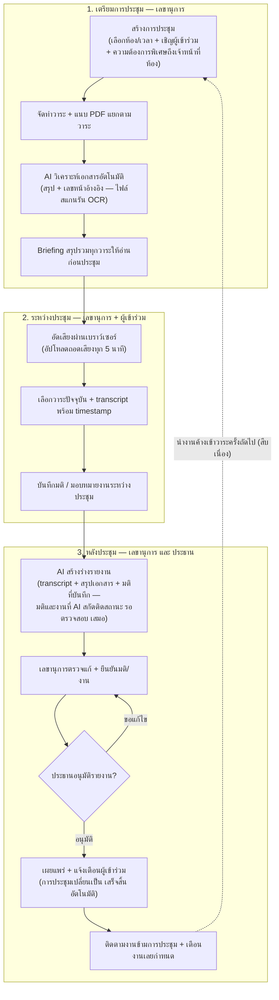
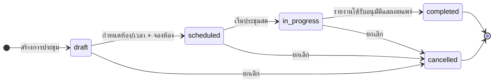
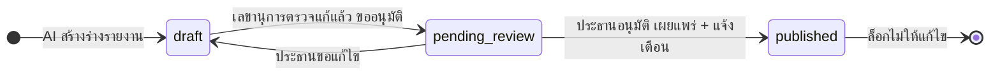
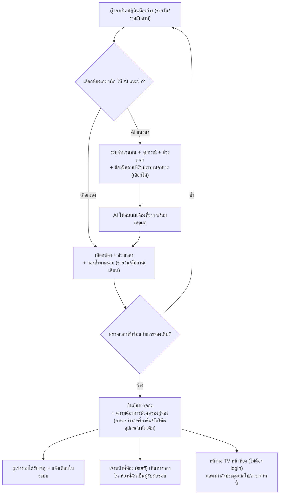

# AI Smart Meeting Management System

ระบบบริหารจัดการการประชุมครบวงจร — จากการจองห้องประชุม การจัดทำวาระพร้อมเอกสาร PDF ที่ AI สรุปให้อ่านก่อนประชุม การบันทึกเสียง-ถอดเสียงระหว่างประชุม ไปจนถึงการสร้างรายงานการประชุม มติ และการติดตามงานที่มอบหมาย

สร้างบน **Nuxt 4 + ElysiaJS + Knex + PostgreSQL** (ตามเอกสารออกแบบ `docs/ออกแบบระบบประชุมอัจฉริยะ.html`) พร้อม shadcn-vue + Tailwind CSS 4

---

## โมดูลของระบบ (ครบทั้ง 5 โมดูลตามเอกสารออกแบบ)

| โมดูล | ความสามารถ | หน้าจอ |
|---|---|---|
| **1. Meeting Room Booking** | ปฏิทินห้องว่างรายวัน/รายสัปดาห์, ตรวจการจองซ้ำ/เวลาทับซ้อน, จองซ้ำตามรอบ (รายวัน/สัปดาห์/เดือน), **ความต้องการพิเศษของผู้จอง** (อาหารว่าง/เครื่องดื่ม/การจัดโต๊ะ/อุปกรณ์เพิ่มเติม — บันทึกไปกับการจอง และแสดงในหน้ารายละเอียดการประชุม), AI แนะนำห้องตามจำนวนคน+อุปกรณ์+ช่วงเวลา+**ต้องมีสถานที่รับประทานอาหาร** (เลือกเพิ่มได้) | `/rooms` |
| **1.1 ข้อมูลห้องประชุม** | รูปห้อง (หลายรูป+เลือกรูปปก), ตึก/ชั้น/ตำแหน่ง, จำนวนโต๊ะ/เก้าอี้/ความจุ, **สถานที่รับประทานอาหาร** (มี/ไม่มี + รายละเอียด เช่น โซนอาหารว่างหน้าห้อง/ใกล้โรงอาหาร — แสดงเป็น badge บนการ์ดห้อง), อุปกรณ์เครื่องเสียง-ภาพพร้อมจำนวน, **ผู้รับผิดชอบประจำห้อง** (เชื่อม users — บัญชีเจ้าหน้าที่บทบาท staff สร้างโดยแอดมินที่หน้า `/admin` แล้วเข้ามาดูตารางจองห้องตัวเองได้ใน "ห้องที่ฉันเป็นผู้รับผิดชอบ") | `/rooms` → แท็บ "ห้องและอุปกรณ์" |
| **1.2 TV Display (สาธารณะ)** | หน้าจอหน้าห้องประชุมสำหรับจอทีวี — **ไม่ต้อง login** แสดงภาพรวมทุกห้องหรือกรองเฉพาะห้อง/ตึก, กำลังประชุมตอนนี้ (พร้อม progress), การประชุมถัดไป, ตารางวันนี้, นาฬิกาเดินสด auto-refresh 30 วินาที — ทีวีหน้าห้องเปิดค้างได้เลย | `/display?room=<roomId>` |
| **2. Agenda & Document** | วาระแบบมีลำดับ (เรียง/สลับได้), ประเภทวาระ (แจ้งทราบ/รับรอง/สืบเนื่อง/พิจารณา), แนบ PDF แยกตามวาระพร้อม versioning + checksum, ผู้นำเสนอ/เวลา, ชุดเอกสาร Briefing | `/meetings/[id]` |
| **3. AI Agenda Assistant** | สกัดข้อความ PDF แยกหน้า (unpdf), สรุปสาระสำคัญ/ประเด็น/ตัวเลขสำคัญ/คำถามที่ควรพิจารณา **พร้อมเลขหน้าอ้างอิง**, เก็บ document chunks สำหรับค้นหาย้อนหลัง, สร้าง Briefing รวมทุกวาระ | `/meetings/[id]` (แท็บ Briefing) |
| **3.1 OCR ไฟล์สแกน** | เมื่อ PDF ไม่มี text layer ระบบ OCR อัตโนมัติ: **Tesseract** (tha+eng — ติดตั้งใน Docker image) → ไม่มีก็ต่อ **AI Vision** (LLM อ่านภาพ) → สรุปมีหมายเหตุ "สกัดด้วย OCR" ให้เลขาตรวจสอบเสมอ | อัตโนมัติ + ปุ่ม "วิเคราะห์ใหม่" |
| **3.2 ค้นหาเชิงความหมาย** | สร้าง **embedding** ของทุก chunk อัตโนมัติ (เมื่อตั้ง AI key) แล้วค้นหาด้วย cosine similarity — ไม่มี AI ก็ fallback เป็นค้นหาคำตรงกัน ผลลัพธ์ชี้เอกสาร/วาระ/**เลขหน้า** เพื่อยืนยันจากต้นฉบับ | `/meetings/[id]` (แท็บ ค้นหาเอกสาร) |
| **4. Live Meeting Assistant** | บันทึกเสียงผ่านเบราว์เซอร์ (MediaRecorder) แบ่งช่วงอัปโหลดทุก 5 นาทีเพื่อถอดเสียงใกล้เรียลไทม์, transcript พร้อม timestamp, เลือกวาระปัจจุบัน+จับเวลา, เชื่อมโยง transcript กับวาระ, บันทึกมติ/มอบหมายงานระหว่างประชุม | `/meetings/[id]/live` |
| **5. AI Minutes & Action Tracking** | AI สร้างร่างรายงานจาก transcript + สรุปเอกสาร, สกัดมติและงาน (mark "รอตรวจสอบ" เสมอ — AI ห้ามแต่งมติ), เลขาตรวจแก้ → ขออนุมัติ → ประธานอนุมัติ → เผยแพร่, บันทึกการเข้าร่วม, ส่งออกรายงาน, ติดตามสถานะงานข้ามการประชุม และนำงานค้างเข้าวาระครั้งถัดไป (สืบเนื่อง) | `/meetings/[id]/minutes`, `/followup` |

รวมถึงระบบฐานราก: **Dashboard** (`/dashboard`), การแจ้งเตือนในระบบ (กระดิงบน header, poll ทุก 30 วินาที), **Audit log** ทุกการกระทำสำคัญ, RBAC (admin/secretary/member/**staff** — เจ้าหน้าที่ห้องประชุม), หน้า **จัดการผู้ใช้** (`/admin` — แอดมินสร้างบัญชี กำหนดบทบาท ตั้ง/รีเซ็ตรหัสผ่าน ปิดใช้งานหรือลบบัญชี พร้อมเห็นห้องที่แต่ละคนรับผิดชอบ) และ admin API สำหรับดู audit logs, AI jobs, system settings, retention policies

## Workflow ครบวงจร (8 ขั้นตามเอกสารออกแบบ)

1. **สร้างการประชุม** → เลือกห้อง/เวลา/เลขา/ผู้เข้าร่วม (จองห้อง+เชิญผู้เข้าร่วมในครั้งเดียว) พร้อมระบุความต้องการพิเศษถึงผู้ดูแลห้องได้ทันที (อาหารว่าง/การจัดโต๊ะ/อุปกรณ์เพิ่มเติม)
2. **จัดทำวาระ + แนบ PDF** แยกตามวาระ
3. **AI วิเคราะห์เอกสาร** อัตโนมัติทันทีที่อัปโหลด (สรุป+เลขหน้าอ้างอิง)
4. **Briefing ก่อนประชุม** — เอกสารสรุปรวมทุกวาระฉบับเดียว
5. **ประชุมสด** — อัดเสียง, เลือกวาระปัจจุบัน, transcript, บันทึกมติ/งานสด
6. **AI สร้างร่างรายงาน** — จากเสียง + สรุปเอกสาร + มติที่บันทึก
7. **ตรวจสอบและเผยแพร่** — เลขาตรวจแก้ → ประธานอนุมัติ → เผยแพร่ + แจ้งเตือน
8. **ติดตามงาน** — สถานะงาน, เตือนงานเลยกำหนด, นำงานค้างเข้าวาระครั้งถัดไป

### แผนภาพ Flow ครบวงจร



### สถานะการประชุมและการอนุมัติรายงาน





### Flow การจองห้องประชุม (Module 1)



## เริ่มต้นใช้งาน

```bash
bun install
bun run dev        # http://localhost:3000
```

บัญชีเริ่มต้น (seed อัตโนมัติครั้งแรก): `admin/password` (ผู้ดูแลระบบ), `secretary/password` (เลขานุการ), `demo/password` (สมาชิก), `staff/password` (เจ้าหน้าที่ห้องประชุม — ผู้รับผิดชอบห้องบอร์ดรูมและห้องประชุมเล็ก 1 ในข้อมูลตัวอย่าง)

ระบบจะสร้างตารางทั้งหมด (30 ตาราง / 6 กลุ่ม) และ seed ข้อมูลตั้งต้นให้อัตโนมัติเมื่อเริ่มรัน

## ตัวแปรสภาพแวดล้อม (`.env`)

ดูทั้งหมดได้ที่ `.env.example` — จุดสำคัญ:

```bash
PASETO_KEY=k4.local....          # session key (สร้างด้วย bun run gen:key)
DB_HOST=127.0.0.1                # PostgreSQL
DB_PORT=5432
DB_USER=postgres
DB_PASSWORD=postgres
DB_NAME=es_nuxt
STORAGE_DIR=./storage            # ที่เก็บไฟล์ PDF/เสียง

# AI (ไม่ตั้งก็ใช้ได้ — ระบบจะทำงานโหมด heuristic ออฟไลน์)
AI_API_KEY=sk-...                # OpenAI-compatible (OpenAI/OpenRouter/9Router)
AI_BASE_URL=https://api.openai.com/v1
AI_MODEL=gpt-4o-mini
AI_STT_MODEL=whisper-1           # ถอดเสียงภาษาไทย
AI_EMBED_MODEL=text-embedding-3-small  # embedding สำหรับค้นหาเชิงความหมาย
# AI_WORKER=off                  # ปิด background worker (กรณีแยก instance)

# OCR ไฟล์สแกน (ทำงานอัตโนมัติเมื่อสกัดข้อความไม่ได้)
# OCR_LANGS=tha+eng              # ภาษา tesseract
# OCR_MAX_PAGES=20               # จำกัดจำนวนหน้าต่อเอกสาร
# TESSERACT_CMD=tesseract        # path ของ tesseract (Docker image ติดตั้ง+ตั้งค่าให้แล้ว)
```

### โหมด AI

- **มี AI_API_KEY**: ใช้ LLM สรุปเอกสาร/สร้างรายงาน (บันทึก token usage ลง `ai_model_usage`) และถอดเสียงผ่าน whisper-compatible API
- **ไม่มี AI_API_KEY**: ทำงานครบวงจรด้วย **heuristic mode** — สรุปแบบ extractive จากข้อความ PDF จริง (ยังอ้างอิงเลขหน้าได้) และ transcript จะเป็นข้อความแจ้งสถานะชัดเจนว่าเป็นโหมดจำลอง — ทุกผลลัพธ์ mark `needs_review` ให้เลขายืนยันเสมอ
- **OCR ไฟล์สแกน**: ทำงานอัตโนมัติเมื่อสกัด text ไม่ได้ — ใช้ Tesseract (tha+eng) ถ้ามี binary (Docker image ติดตั้งไว้), ไม่มีก็ใช้ AI Vision, ไม่มีทั้งคู่จะแจ้งเลขาให้ตั้งค่า แล้วกด "วิเคราะห์ใหม่" ได้
- **ค้นหาเชิงความหมาย**: มี AI → สร้าง embedding ทุก chunk อัตโนมัติและค้นด้วย vector / ไม่มี AI → ค้นคำตรงกัน (ILIKE) ผลลัพธ์แสดง % ความเกี่ยวข้อง + snippet + เลขหน้าเอกสารเสมอ

## สถาปัตยกรรม

```
├─ api/                        # ElysiaJS API (mount ที่ /api ผ่าน nuxt-elysia)
│  ├─ db/schema.ts             # สร้าง/seed ตารางทั้ง 30 ตาราง (idempotent)
│  ├─ middleware/auth.ts       # PASETO session → context.user
│  ├─ routers/                 # แยกตามโมดูล: rooms, bookings, meetings, agendas,
│  │                           # documents, live, minutes, followup, notifications,
│  │                           # dashboard, admin, public (TV display), search
│  │                           # (+ auth, users เดิม)
│  └─ services/
│     ├─ ai/provider.ts        # OpenAI-compatible client (chat + STT)
│     ├─ ai/heuristic.ts       # fallback ออฟไลน์
│     ├─ ai/handlers.ts        # โลจิกงาน AI 4 ประเภท
│     ├─ jobs.ts               # คิวงาน DB-backed (ตาราง ai_jobs) + worker in-process
│     ├─ pdf.ts                # สกัดข้อความ PDF แยกหน้า (unpdf) + chunking
│     ├─ ocr.ts                # OCR ไฟล์สแกน (render หน้า→รูป + Tesseract/AI Vision)
│     ├─ storage.ts            # storage abstraction (local FS → เปลี่ยนเป็น S3/MinIO ได้)
│     ├─ audit.ts              # audit log
│     └─ notifications.ts      # in-app (+ ต่อ LINE OA/email ภายหลังได้)
├─ app/pages/                  # dashboard, rooms, meetings, meetings/[id],
│                              # meetings/[id]/live, meetings/[id]/minutes, followup
└─ app/composables/            # useAuth, useMeetingApi, useNotifications
```

**หลักการตามเอกสารออกแบบ**: API รับคำสั่ง → สร้าง job ในตาราง `ai_jobs` → worker (poll ทุก 2 วินาที, retry 3 ครั้ง) ประมวลผลเบื้องหลัง — API ไม่ค้างแม้ไฟล์ใหญ่ คิวนี้สลับเป็น Redis+BullMQ ได้โดยแก้เพียง `api/services/jobs.ts`

**การควบคุมความถูกต้องของ AI**: มติ/งานที่ AI สกัดมีสถานะ `pending_review` เสมอ ต้องผ่านการยืนยันของเลขานุการก่อน และรายงานต้องได้รับอนุมัติจากประธานการประชุมก่อนเผยแพร่ (ระบบจะเปลี่ยนสถานะการประชุมเป็น "เสร็จสิ้น" อัตโนมัติ)

## ฐานข้อมูล (6 กลุ่ม / 30 ตาราง)

- **G1 ผู้ใช้และห้อง**: `users`, `roles`, `user_roles`, `meeting_rooms` (รวมตึก/ชั้น/โต๊ะ/เก้าอี้/ผู้รับผิดชอบ/สถานที่รับประทานอาหาร), `room_images` (รูปห้อง+รูปปก), `room_equipment`, `room_bookings` (รวมความต้องการพิเศษของผู้จอง)
- **G2 การประชุมและวาระ**: `meetings`, `meeting_participants`, `meeting_agendas`, `meeting_documents`, `agenda_ai_summaries`
- **G3 เสียงและ Transcript**: `meeting_recordings`, `transcription_jobs`, `transcript_segments`, `agenda_transcript_links`
- **G4 ผลการประชุม**: `meeting_minutes`, `meeting_decisions`, `meeting_action_items`, `meeting_attendance`, `meeting_approvals`
- **G5 AI และงานเบื้องหลัง**: `ai_jobs`, `ai_job_results`, `ai_model_usage`, `ai_prompts`, `document_chunks`
- **G6 ระบบ**: `notifications`, `audit_logs`, `system_settings`, `retention_policies`

## คำสั่งที่มีประโยชน์

```bash
bun run dev                     # dev server
bun run build                   # production build (Nitro Bun preset)
bun run preview                 # รัน production build
bun run gen:key                 # สร้าง PASETO_KEY
bun x tsc -p tsconfig.api.json  # typecheck เฉพาะ API
bun x nuxt typecheck            # typecheck ทั้งโปรเจกต์
```

## การต่อยอด (ตามแผนในเอกสารออกแบบ)

- **LINE OA / Email**: เพิ่ม provider ใน `api/services/notifications.ts` (โครง channel รองรับแล้ว)
- **MinIO/S3**: แทนที่ implementation ใน `api/services/storage.ts`
- **Speaker diarization**: ผู้ให้บริการ STT ที่รองรับ (segments มีฟิลด์ speaker แล้ว)
- **pgvector**: ปัจจุบันเก็บ embedding เป็น jsonb + คำนวณ cosine ใน JS (เพียงพอสำหรับหลักพัน chunks) — หากเอกสารโตขึ้นมาก เปลี่ยนคอลัมน์เป็น `vector` ของ pgvector และใช้ index HNSW/IVFFlat
- **Redis + BullMQ**: แทนที่ `api/services/jobs.ts` เมื่อต้อง scale worker แยก instance

---

## Gitlab CI/CD Prodction

```
เปลี่ยนชื่อไฟล์ .gitlab-ci.yml.prd ---> .gitlab-ci.yml
```

### สร้างโฟล์เดอร์โปรเจกต์
```
mkdir -p ~/app-docker
cd ~/app-docker
mkdir cloudflared
```

### config docker-compose.yml

เปลี่ยนไปเป็น repo ของตัวเอง
exp repo: phingosoft/es-nuxt

```
image: "registry.gitlab.com/phingosoft/es-nuxt:latest"
```

### config cloudflare tunnel
```
mkdir cloudflared
```

---
Built with [Nuxt](https://nuxt.com/), [Elysia](https://elysiajs.com/), and [Shadcn-Vue](https://www.shadcn-vue.com/)
